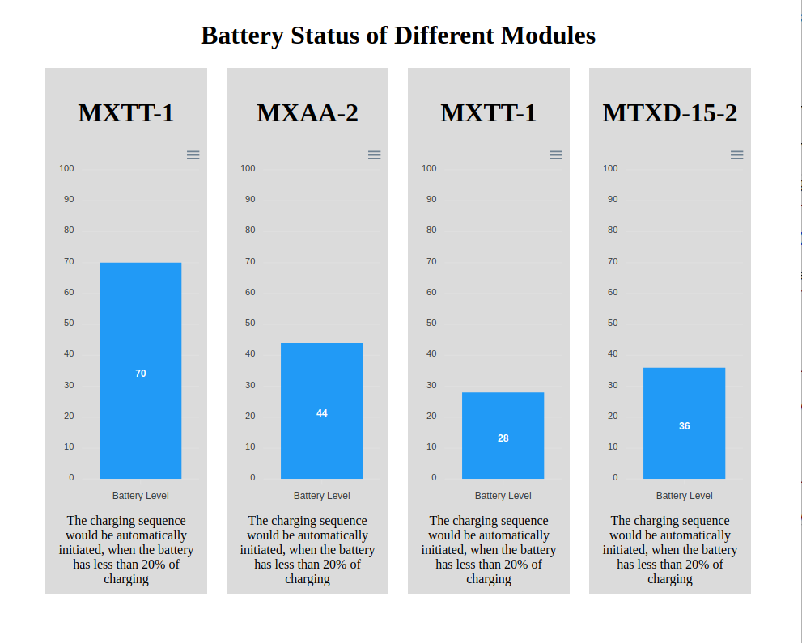

# Battery Status of Different Devices

- The purpose of this project is to mimic the battery status of differnt IOT devices.
- As the battery status of any device is less than 20% the recharging started.
